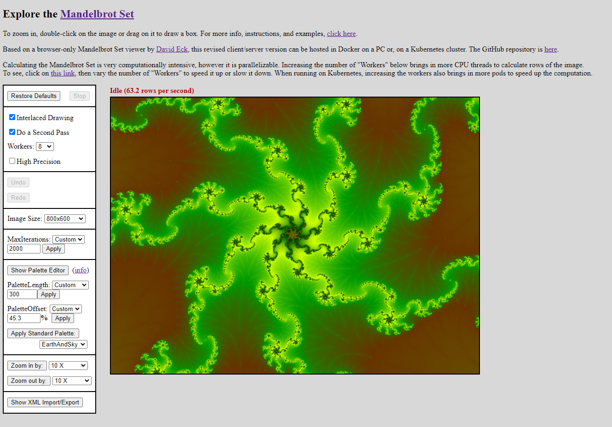

# MandelRust


## Overview
This full-featured Mandelbrot web app is fast due to its use of Rust for doing the calculations. These can be done in your browser, or you can install the backend web server for more speed.  The web server can run on bare metal (your PC or a server), in Docker, or on Kubernetes, where it can scale to multiple pods.

Try the browser-only version at https://wpwoodjr.github.io/MandelRust



The original version by [David Eck](http://math.hws.edu/eck/index.html) runs entirely in the browser, and all calculations are done in Javascript.  This rewritten version calculates in the browser or optionally using a backend server.  The in-browser calculations are implemented in Rust and deployed in the browser via WebAssembly.  For high precision calculations, this is about 5-7 times faster than the Javascript version.  The backend server is implemented entirely in Rust using Actix-web.  It can be up to 15 times faster than the original Javascript version.


### Getting started
#### Docker
Clone or download this repo, then build and run in Docker as follows:
```
cd Mandelbrot-for-Docker-and-Kubernetes
./docker-build.sh
./docker-run.sh
```
Then browse to `localhost:8001`.

#### Local build/run
If you don't want to use Docker, you can run the server locally.  A Rust compiler is a pre-requisite.  First, clone or download this repo. Then, build and run as follows:
```
cd Mandelbrot-for-Docker-and-Kubernetes
./local-build.sh
./local-run.sh
```
Then browse to `localhost:8000`.

#### Kubernetes
Clone or download this repo, then build and deploy in Kubernetes as follows:
```
cd Mandelbrot-for-Docker-and-Kubernetes
... WIP ...
```
Once the application is deployed to Kubernetes, browse to `<url>`.


